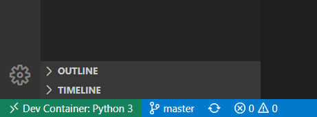

# Using VS Code remote development in Docker container (Ptyhton & Flask)
The main purpose of this repo is to create a sample Python app and try out development using VS Code's Remote Development feature with Docker containers. 

Motivation:
I would like to develop, interpret and run my Python code remotely without installing Python interpreter and packages on my Windows machine. Instead spin up a Python Docker container with all required dependencies.

Main tasks I want to achieve:
- [X] Setup remote Python development with Visual Studio Code
- [X] Create some simple REST APIs with Flask to
    - [X] return static index.html at `"/"`
    - [X] return text "Hello World" under `"/hello"`
    - [X] return Top 250 movies from IMDb at `"/imdb/movies/top250"`
        - scrape [Imdb Top 250 movies](https://www.imdb.com/chart/top/?ref_=nv_mv_250) table from webpage with using [beautifulsoup4](https://www.crummy.com/software/BeautifulSoup/bs4/doc/#quick-start),
        - parse into a class in "/model/topMovie.py"
        - serialize objects and return as Json array 
        ```
        {
            "results": [
            {
                "rank": "1.",
                "rating": "9.2",
                "title": "Die Verurteilten"
            },
            ...
        }
        ```

## Developing inside a Container
The Visual Studio Code Remote - Containers extension lets you use a Docker container as a full-featured development environment. 
[VS Code Remote guide](https://code.visualstudio.com/docs/remote/containers#_quick-start-open-a-folder-in-a-container)

### Install Plugins
With the help of these plugins you can easily create and develop your Python code.

1. [Python plugin for local edit](https://marketplace.visualstudio.com/items?itemName=ms-python.python) 

2. [Remote Containers plugin](https://marketplace.visualstudio.com/items?itemName=ms-vscode-remote.remote-containers)

# How to setup 
0. In the root directory of your project, you need to create a folder called .devcontainer
    - This is where we will store the settings for our environment.
    - The naming is important!
1. Under this .devcontainer folder:
    - Create a devcontainer.json file (Hit F1 and select 'Remote-containers Create container configuration files') Basically a config file that determines how your dev container gets built and started.
    - Create a docker-compose.yml [Sample](https://github.com/microsoft/python-sample-tweeterapp/blob/master/.devcontainer/docker-compose.yml) With this we can setup more complex environments and add additional services like databases etc.
    - Create a Dockerfile [Sample](https://github.com/microsoft/python-sample-tweeterapp/blob/master/.devcontainer/Dockerfile) Within  we choose the image and we can add any RUN commands (such as global installs).
## Python specific steps
2. You can create a 'requirements.txt' or 'requirements.temp.txt' to define which Python dependencies needed to be installed for your app (E.g.: flask)
    - For install requirements run this command inside the devcontainer: `pip install -r requirements.txt`
3. Add some sample python code (app.py and static files) from [VS code try python](https://github.com/microsoft/vscode-remote-try-python)
## Reopen workspace inside the devcontainer context
4. Hit F1 and select 'Remote-Containers: Reopen Folder in Container'
    - This will reopen VS Code and your workspace in a remote window, connected to the VS Code server which is running inside the container based on your Dockerfile.
    - Once the container is running and you're connected, you should see your remote context change in the bottom left of the Status bar: 
    


 5. Check your environment `python --version` and `pip list`
    
# Start the sample Python app and open it from the host
7. For start the Python app we simply should  execute this command from the VS Code terminal: 'flask run'
8. For make the APIs available from the host we first need to forward the ports from the container. 
    1. For this Hit F1 and select 'Forward a Port' 
        - In older versions 'Remote-Containers: Forward Port from Container'
    2. Enter port number 5000.
9. Open your browser and navigate to `localhost:5000`
    - (In older versions Click "Open Browser" in the notification that appears to access the web app on this new port.)


Notes:
- Files added/created at the workspace in the host outside the devcontainer context not gonna appear. You need to rebuild the devcontainer. Hit F1 then select option "Remote-Containers: Rebuild Container"
